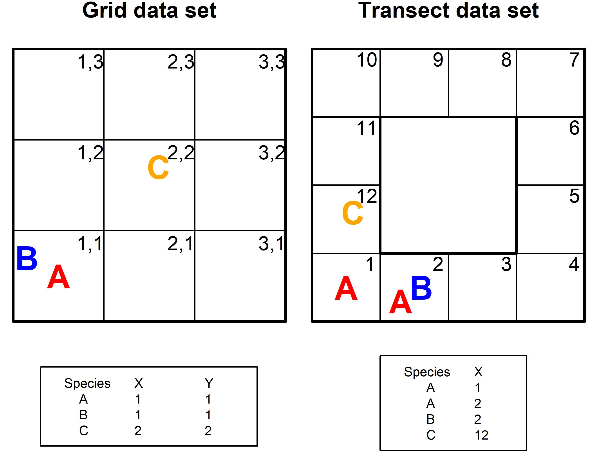
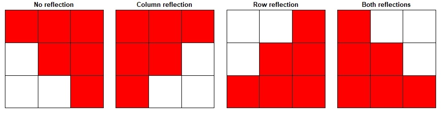
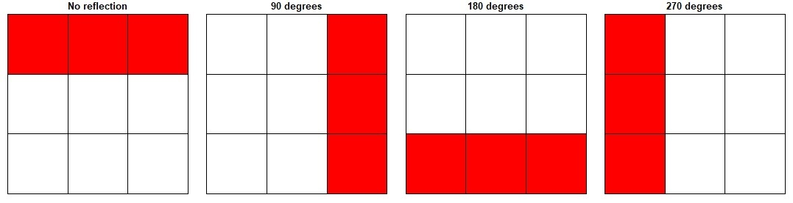
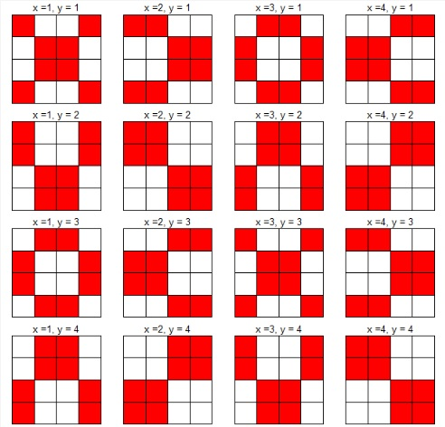

```{=html}
<style>
body {
text-align: justify}
</style>
```

------------------------------------------------------------------------

```{r, include = FALSE}
knitr::opts_chunk$set(
  collapse = TRUE,
  comment = "#>"
)
```

## Introduction

The comspat (within-**com**munity **spat**ial organization) R package introduces two diversity measures - the Number of Realized Species Combinations (***NRC***) and Compositional Diversity (***CD***) to model plant species co-occurrence patterns as a function of increasing sampling resolution. These diversity measures represent two commonly used measures emerging from a family of models grounded in Information Theory (see Juhász-Nagy, 1967, 1976, 1984a, 1984b, 1993; Juhász-Nagy & Podani, 1983).

This document provides a step-by-step guide demonstrating the workflow of `'comspat'` with practical examples and expanded explanatory text.

### Step 1. Exploring the simulated and real data sets

The raw data (x) accepted by all functions in the package is a matrix (x) codifying the presence of *m* species in *n* primary sampling units as rows. Sites collected as a grid must contain columns (named 'X' and 'Y') referring to a specific sampling unit positioned in a grid sampling design. The cartesian coordinate 1, 1 refers to the first sampling unit of a grid. Sites collected as transect must contain the column named 'X', referring to a specific sampling unit recorded within a contiguous number sequence (starting at 1). For a crosswalk between grid and transect sample designs and the accepted data format see **Fig S1**.

{width="4.5393701in"}

```{r}
# Lets have a look at the first few lines and structure of the example data sets

# View the grid data set
library(comspat)
head(grid_patchy_associated)
str(grid_patchy_associated)

# View the transect data set
head(tran_grass_s)
str(tran_grass_s)
```

The package contains one simulation and two other grids derived by randomization and two real transect data sets (**Table 1**). The first grid data set (patchy associated) features patchy patterns with interspecific associations between species due to limited dispersal and interactions between species and due to their different responses to environmental heterogeneity. The second grid data set (patchy no isc) was a created using a random shift randomization where the interspecific species associations were randomized but intraspecific spatial dependence relationships were maintained. The third grid data set (complete random) was created using a complete spatial randomization where no intraspecific autocorrelations and no interspecific spatial associations are present. Please see **Step 6** below for detailed information on the applied randomizations.

We provide two transects with real data sampled in open sand grassland in Hungary (**Table 1**). These data sets were derived from Bartha et al.'s (2008) long-term study on the effect of climate change on the interannual variability of grassland communities. The transect data sets represent: (1) the spatial pattern data of frequent species (species with more than 25 presences along the transect were selected as a threshold from standard textbooks), and (2) the spatial pattern data of plant functional types (PFTs) (in this case data of species which belong to the same functional groups were merged). These data represent the same transect and same community. However, for PFTs the data of rare species were also considered within the particular PFT. For simplicity, we have only selected a 25 m example with a typical pattern; this extent (transect length) is representative of the community pattern. For more details please see Bartha et al. (2008).

**Table 1.** Properties of the randomized grid and real transect data sets included within the package. The table shows the name, the sampling type, dimensions (Dim), number of species (NSP), simulated drivers of the spatial patterns and the source of the data sets provided by the package.

+---------------------------+----------+---------+-----+-------------------------------------------------------------------------------------------------------------------------------+--------------------------------------+
| Data set name             | Type     | Dim     | NSP | Type of patterns                                                                                                              | Reference                            |
+:==========================+:=========+:========+:====+:==============================================================================================================================+:=====================================+
| grid_patchy_associated    | Grid     | 64 ⨯ 64 | 6   | interspecific and intraspecific spatial dependence due to simulated abiotic and biotic interactions                           | Czárán (1993) & Bartha et al. (1998) |
+---------------------------+----------+---------+-----+-------------------------------------------------------------------------------------------------------------------------------+--------------------------------------+
| grid_patchy\_[n_isc]{.ul} | Grid     | 64 ⨯ 64 | 6   | only intraspecific spatial dependence after removing interspecific relationships from the original patterns by randomizations | Bartha & Kertész (1998)              |
+---------------------------+----------+---------+-----+-------------------------------------------------------------------------------------------------------------------------------+--------------------------------------+
| grid_random               | Grid     | 64 ⨯ 64 | 6   | random distributions after removing both intra- and interspecific relationships by randomizing the original patterns          | Bartha & Kertész (1998)              |
+---------------------------+----------+---------+-----+-------------------------------------------------------------------------------------------------------------------------------+--------------------------------------+
| tran_grass_s              | Transect | 500 ⨯1  | 10  | --                                                                                                                            | Bartha et al. (2008)                 |
+---------------------------+----------+---------+-----+-------------------------------------------------------------------------------------------------------------------------------+--------------------------------------+
| tran_grass_t              | Transect | 500 ⨯1  | 6   | --                                                                                                                            | Bartha et al. (2008)                 |
+---------------------------+----------+---------+-----+-------------------------------------------------------------------------------------------------------------------------------+--------------------------------------+

```{r, fig.width = 7.1, fig.cap="**Fig. S2**. Spatial distribution of the patchy associated, patchy no interspecific association and completely random (i.e. the grid patchy_associated, grid_patchy_n_isc and grid_mixed_random, resp.) data sets."}
# View the species spatial distributions

# Store user default parameter arguments to reset on exit
oldpar <- par(no.readonly = TRUE)
on.exit(par(oldpar))

# Set plot parameters
par(mar = c(0.5, 0.5, 0.5, 0.5), pty = "s", ps = 12, mfrow = c(1, 3))
colvec <- sample(c("#1b9e77", "#d95f02", "#7570b3", "#e7298a", "#66a61e",
                   "#e6ab02"), 6)

# Plot the patchy associated data frame
plot(y = grid_patchy_associated$Y, x = grid_patchy_associated$X,
     xlab = "", ylab = "", xaxt = "none", yaxt = "none", cex = 0)
points(y = grid_patchy_associated$Y, x = grid_patchy_associated$X,
       pch = c(22, 17, 18, 2, 20, 18)[grid_patchy_associated$Species],
       col = colvec[grid_patchy_associated$Species],
       bg = c("yellow2")[grid_patchy_associated[grid_patchy_associated[, 3] ==
                                                  "Sp1", "Species"]],
       cex = c(0.8, 0.8, 0.8, 0.6, 0.8, 1)[grid_patchy_associated$Species],
       lwd = 2)
box(which = "plot", lwd = 2)
legend("topleft", as.expression(bquote(bold("A"))),
       inset = c(-0.3, -0.12), bty = "n", cex = 2)

# Plot the patchy random data frame
plot(y = grid_patchy_n_isc$Y, x = grid_patchy_n_isc$X, xlab = "", ylab = "",
     xaxt = "none", yaxt = "none", cex = 0)
points(y = grid_patchy_n_isc$Y, x = grid_patchy_n_isc$X,
       pch = c(22, 17, 18, 2, 20, 18)[grid_patchy_n_isc$Species],
       col = colvec[grid_patchy_n_isc$Species],
       bg = c("yellow2")[grid_patchy_n_isc[grid_patchy_n_isc[, 3]
                                         == "Sp1", "Species"]],
       cex = c(0.8, 0.8, 0.8, 0.6, 0.8, 1)[grid_patchy_n_isc$Species],
       lwd = 2)
box(which = "plot", lwd = 2)
legend("topleft", as.expression(bquote(bold("C"))),
       inset = c(-0.3, -0.12), bty = "n", cex = 2)

# Plot the mixed random data frame
plot(y = grid_random$Y, x = grid_random$X, xlab = "", ylab = "",
     xaxt = "none", yaxt = "none", cex = 0)
points(y = grid_random$Y, x = grid_random$X,
       pch = c(22, 17, 18, 2, 20, 18)[grid_random$Species],
       col = colvec[grid_random$Species],
       bg = c("yellow2")[grid_random[grid_random[, 3] == "Sp1", "Species"]],
       cex = c(0.8, 0.8, 0.8, 0.6, 0.8, 1)[grid_random$Species],
       lwd = 2)
box(which = "plot", lwd = 2)
legend("topleft", as.expression(bquote(bold("B"))),
       inset = c(-0.3, -0.12), bty = "n", cex = 2)

```

These steps show how to visualize the species frequency of occurrence within the grid data sets.

```{r, fig.width = 7.1, fig.cap="**Fig. S3**. Frequency distribution of species in the patchy associated, patchy no interspecific association and patchy random (i.e. the grid_patchy_associated, grid_patchy_n_isc and grid_mixed_random, resp.) data sets. Note that species abundance relationships are identical in the three example grids and only their spatial patterns are different."}
# View the species frequency of occurrence

# Set plot parameters
par(mar = c(4, 5, 2, 1), cex = 0.8, mfrow = c(1, 3))
colvec <- c("lightgoldenrod", "sienna1", "mediumspringgreen", 
            "forestgreen", "red4", "blue")

# Plot the patchy associated data frame
barplot(table(grid_patchy_associated$Species), col = colvec, las = 2,
        ylim = c(0, 800))
mtext("Species frequency", side = 2, line = 3.5, cex = 0.8, font = 2)
box(which = "plot", lwd = 2)

# Plot the patchy random data frame
barplot(table(grid_patchy_n_isc$Species), col = colvec, las = 2,
        ylim = c(0, 800))
mtext("Species frequency", side = 2, line = 3.5, cex = 0.8, font = 2)
box(which = "plot", lwd = 2)

# Plot the mixed random data frame
barplot(table(grid_random$Species), col = colvec, las = 2, ylim = c(0, 800))
mtext("Species frequency", side = 2, line = 3.5, cex = 0.8, font = 2)
box(which = "plot", lwd = 2)
```

Now that we have demonstrated that the grid data sets all feature the same species abundance distributions we might also like to look at how the distributions of species combinations vary between the grids. To achieve this goal we have defined a helper function. Please see the `'freq_comb'` function and documentation.

```{r, fig.width = 7.1, fig.cap="**Fig. S4**. Barplot demonstrating the differences of the frequency distribution of species combinations among the contrasting types of patterns represented by the grid data sets. Each bar represents a specific species combination occurring within the smallest sample unit size."}
# Plot the distribution of species combinations

# Get the species frequency at the Primary Sampling unit Scale
a <- freq_comb(grid_patchy_associated, type = "Grid", dim_max = 64)
b <- freq_comb(grid_patchy_n_isc, type = "Grid", dim_max = 64)
c <- freq_comb(grid_random, type = "Grid", dim_max = 64)

# Now we need to prepare the data for a simple bar plot
# Assign a name to the data set
a$dat <- "patchy associated"
b$dat <- "patchy no isc"
c$dat <- "random"

# Join the data together
a <- rbind(a, b, c)

# Reshape the data
data_base <- reshape(a, idvar = "dat", timevar = "combinations", 
                     direction = "wide")
data_base[is.na(data_base)] <- 0
row.names(data_base) <- data_base$dat
data_base$dat <- NULL
data_base <- as.matrix(data_base)
colnames(data_base) <- gsub(pattern = "Freq.", replacement = "", 
                            colnames(data_base))

# Create the barplot (note that we are using log transformation so was can better view the different combinations)
par(mar = c(8, 4, 1, 1))
barplot(height = log1p(data_base), beside = TRUE, cex.names = 0.7,
        las = 2, col = c("red", "blue", "green"))
legend("topright", legend = row.names(data_base),
       col = c("red", "blue", "green"), pch = c(15, 15, 15), pt.cex = 1.5)
axis(side = 1, line = 4, at = 15, expression(italic("grain size = 0.04 sq.m*")),
     tick = FALSE, cex.axis = 0.75)
mtext("Species combinations", 1, 6.5, font = 2)
mtext("Freqency (log %)", 2, 2.5, font = 2)
box(lwd = 2)
```

These steps show how to visualize the species spatial distributions within the transect data sets.

```{r, fig.width = 7.1, fig.cap="**Fig. S5**. Spatial distribution of the species and plant functional types along the length of the transect data sets."}
# View the species spatial distributions

# Set plot parameters
par(mar = c(8, 3, 2, 1), mfrow = c(1, 2), cex = 0.8)

# Plots the transect plant functional type data frame
plot(as.numeric(tran_grass_s$Species) ~ as.numeric(tran_grass_s$X),
     xaxt = 'n', yaxt = 'n', ann = FALSE, xlim = c(0,500),
     pch = c(3, 4, 15:22)[tran_grass_s$Species],
     col=c("red","blue","green","pink","orange","black",
           "red","blue","green","pink")[tran_grass_s$Species])
axis(1, at = c(0, 500), labels = c(0, 500))
mtext("Species", side = 2, line = 1.5, font = 2, cex = 0.8)
mtext("Plant presences in 5x5cm units", side = 1, line = 1, font = 2, cex = 0.8)
box(which = "plot", lwd = 2)

legend(x = 20, y = -2.3, legend = c(levels(tran_grass_s$Species)),
       pch = c(3, 4, 15:22),
       col = c("red","blue","green","pink","orange","black",
           "red","blue","green","pink"),
       ncol = 2, cex = 0.8,
       xpd = TRUE)

# Plots the transect plant functional type data frame
plot(as.numeric(tran_grass_t$Species) ~ as.numeric(tran_grass_t$X),
     xaxt = 'n', yaxt = 'n', ann = FALSE, xlim = c(0,500),
     pch = c(3, 4, 15:18)[tran_grass_t$Species],
     col = c("red", "blue", "green", "pink", "orange", "black")[tran_grass_t$Species])
axis(1, at = c(0, 500), labels = c(0, 500))
mtext("Plant functional types", side = 2, line = 1.5, font = 2, cex = 0.8)
mtext("PFT presences in 5x5cm units", side = 1, line = 1, font = 2, cex = 0.8)
box(which = "plot", lwd = 2)

legend(x = 50, y = -1.2, legend = c(levels(tran_grass_t$Species)),
       pch = c(3, 4, 15:18),
       col = c("red", "blue", "green", "pink", "orange", "black"),
       ncol = 2, cex = 0.8,
       xpd = TRUE)
```

These steps show how to visualize the species frequency of occurrence within the transect data sets.

```{r, fig.width = 7.1, fig.cap="**Fig. S6**. Frequency distribution of the species and plant functional types (PFT)  within the transect data sets."}
# View the species frequency of occurrence

# Set plot parameters
par(mar = c(7.5, 5, 1, 1), mfrow = c(1, 2), cex = 0.8, cex.axis = 0.8)

# This part plots the transect species data frame
barplot(table(tran_grass_s$Species), las = 2, ylim = c(0, 200))
mtext("Species frequency", side = 2, line = 3.5, font = 2)
box(which = "plot", lwd = 2)

# This part plots the patchy associated data frame
barplot(table(tran_grass_t$Species), las = 2, ylim = c(0, 400))
mtext("PFT frequency", side = 2, line = 3.5, font = 2)
box(which = "plot", lwd = 2)
```

### Step 2. Preparing the parameter data set

The `'comspat'` function performs computerized sampling (called secondary sampling) from the primary (grid or transect) data. During secondary sampling users can change the sampling grain (by merging adjacent sampling units into larger ones. To control the secondary sampling procedure, the user must specify several sampling parameters. The secondary sampling parameters are supplied to the params argument as a data frame. The parameter data frame stores the secondary sampling parameters as a series of steps stored as rows. The parameter data frame also contains columns which specify the length and height of the secondary sampling units. The units supplied to the length and height columns must correspond to the number of primary sampling units in each dimension. The height dimension is not required where sampling was conducted as a transect. We have used Wensel's (1975) method within our package, where incomplete sampling units are complemented by fragments taken from the opposite edge of the mapped grid. While we highly recommend following the guideline sequentially if you would like to visualize this secondary sampling routine please inspect our gif animations embedded as **Fig. S10**. Please note that these will appear as static images in pdf format.

We recommended that the size of the secondary sampling units follow a logarithmic spatial scale during the first approximation of the functions (**Fig. S8**). In this manner, exponential enlargement of the secondary sampling units is achieved. The largest secondary sampling unit should be less than a quarter of the total sampling area to reduce the edge effect. The ultimate selection of secondary sampling units should consider the distribution of maxima functions. After having the first results, the estimates can be improved by modifying of the secondary sampling (using more or different sampling unit sizes).

```{r, fig.cap="**Fig. S7**. Example of spatial scaling using exponentially increaseing of in secondary sampling unit sizes."}
# Load and visualize the parameter data set
data("param_grid")

# The sample unit size of our simulated data was 5 cm x 5 cm
su_area <- param_grid[,2] * param_grid[,3] * (0.05 * 0.05)

# Plot the area
par(mar = c(4.5, 4.5, 0.5, 0.5), ps = 12)
plot(su_area ~ c(1:16), type = 'b', pch = 19, las = 2,
     ylab = "Sample Unit Area", 
     xlab = "Steps of Scaling")
mtext(text = expression('(cm'^2*')'),
      side = 2, line = 1.9, cex = 0.6)

```

### Step 3. Calculation of the Information Theory models

Here, using visual aids, we demonstrate NRC and CD's calculation at two scaling steps (spatial-scale 1 and -scale 2) using example grid data (**Figure S8**). The mathematical formula follows Juhász-Nagy (1967, 1976, 1984b, 1984a, 1993) summarized here.

CD is a descriptor of the spatial variability of the realized species combinations within a community expressed as the diversity of the species combinations in a sample: $$
H_{j} (A,B, ..., Y) = -\sum_{k=1}^{2^s} p_{kj} \times log_{2}(p_{kj})
$$ Where A, B, ..., Y are the s species of the community; p~*kj*~ is the probability of finding a particular species combination (i.e. the k^th^ combination of species) within the sample at a specific sampling unit size *j*; k ranges from 1 to 2^s^ and is the number of the realized combination (NRC) of species.

{width="95%"}

### Step 4. Computerized sampling of the data sets

Complete sampling, i.e. sampling from every possible positions with overlaps (cf. Bartha et al. 1995) within the sample universe was used to calculate NRC and CD.

{width="95%"}

While a picture paints a thousand words, perhaps an animation of the secondary sampling will solidify your understanding further. Here we present the complete sampling of every position within the sample universe of a grid (sized at 10 x 10 grids) at three spatial scaling steps.


### Step 5. comspat without null models.

The `'comspat'` function allows users to calculate Information Theory models with and without null models. Analysis without the use of null models is a useful feature during the data exploration phase. It is useful because it allows users to optimize their parameter data set and to visually assess the data without the requirement of parallel computing (initiated when null models are generated) and waiting for potentially time-intensive calculations to complete. Here we demonstrate how the `'comspat_plot'` function can be used to prepare a graphical output. Because the plotting function was created using R's base plotting code it is compatible with several common plotting functions (including `'par'`).

```{r, echo=FALSE}
load("ms_results.rdata")
```

```{r, eval=FALSE, echo=TRUE, fig.width = 7.1, fig.cap="**Fig. S12**. Number of realized combinatons and compositional diversity of the three simulated grid data sets. Red, blue and green represent the grid.random, grid.patchy.n.ISC and grid.patchy.associated data sets."}
# Calculate the NRC and CD for the grid data sets.
g_r <- comspat(data = grid_random, params = param_grid,
               dim_max = 64, type = "Grid")
g_pr <- comspat(grid_patchy_n_isc, param_grid, 64, "Grid")
g_pa <- comspat(grid_patchy_associated, param_grid, 64, "Grid")

# Usage of comspat_plot
# Lets visualize CD for all grid data sets on one plot.
data <- list(g_r, g_pr, g_pa)
p_col <- list("red", "blue", "green")
par(mar = c(3.5, 3, 0.5, 0.5), mfrow = c(1, 2))

# Let us start by adding the Compositional Diversity (i.e. CD)

comspat_plot(data = data, params = param_grid, type = "Grid", measure = "CD",
             su_size = 0.01, ymin = 0, ymax = 5.5, xmax = 1, p_col = p_col)

# Hint, try changing the measure argument to "NRC"
comspat_plot(data = data, params = param_grid, type = "Grid", measure = "NRC", 
             su_size = 0.01, ymin = 0, ymax = 65, xmax = 1, p_col = p_col)

```

```{r, eval=TRUE, echo=FALSE, fig.width = 7.1, fig.cap="**Fig. S11**. Number of realised combinatons and compositional diversity of the three simulated grid data sets. Red, blue and green represent the grid_random, grid_patchy_n_isc and grid_patchy_associated data sets."}

# Calculate the NRC and CD for the grid data sets.
#g_r <- comspat(data = grid_random, params = param_grid,
#               dim_max = 64,type = "Grid")
#g_pr <- comspat(data = grid_patchy_n_isc, params = param_grid,
#                dim_max = 64,type = "Grid")
#g_pa <- comspat(data = grid_patchy_associated, params = param_grid,
#                dim_max = 64, type = "Grid")


# Usage of comspat_plot
# Lets visualize CD for all grid data sets on one plot.
data <- list(g_r, g_pr, g_pa)
p_col <- list("red", "blue", "green")
par(mar = c(3.5, 3, 0.5, 0.5), mfrow = c(1, 2))

# Let us start by adding the Compositional Diversity (i.e. CD)

comspat_plot(data = data, params = param_grid, type = "Grid", measure = "CD",
             su_size = 0.01, ymin = 0, ymax = 5.5, xmax = 10, p_col = p_col)
mtext("CD", side = 2, line = 2, font = 2)

# Hint, try changing the measure argument to "NRC"
comspat_plot(data = data, params = param_grid, type = "Grid", measure = "NRC", 
             su_size = 0.01, ymin = 0, ymax = 65, xmax = 10, p_col = p_col)
mtext("NRC", side = 2, line = 2, font = 2)

```

Visual inspection of **Figure S11** suggests that NRC and CD peak at low levels and at larger sampling units within the simulated (grid_patchy_n\_isc) data set compared to the grid_random and grid_patchy_n\_isc data sets.

When studying plant species co-occurrence patterns, one can never be sure if there is spatial dependence among species. Under natural (real world) conditions, the causes of the spatial association are not discernible from the examination of the patterns alone. For revealing mechanisms, we should use repeated measures (through time) or manipulative experiments (Rejmanek & Leps 1966). Indeed, designing an experiment to unravel the causes of spatial association in species-rich systems presents a unique (and time and resource-intensive) challenge. Indeed, there are several problems with applying standard statistical tests. In short, this is because sampling units overlap, they are not strictly independent (Podani 1984; Podani et al. 1993). Fortunately, we can compare the observed data against random references and use Monte-Carlo simulations as a basis of the significance test (i.e. null models). Null models are commonly applied to address many ecological questions, especially where experimentation is impossible or where classical statistical methods fail (Gotelli & Graves 1996).

### Step 6. comspat with null models.

Of the many types of randomizations potentially available to produce random references we have selected to use **complete spatial randomness (CSR)** and **random shift (RS)**. Both of these randomizations have and extensive history in ecological studies and been used with JNP models in the past. In the case of CSR, all relationships (within species and between species relationships) are randomized. In the random shift, only interspecific relationships are randomized while maintaining the spatial dependence of species.

Random shifts are a type of randomization procedure that consists of moving a map (i.e. map of the coordinates of species) about a two-dimensional torus in four cardinal directions (see Harms 1997). Random shifts applied to transects can only occur along two cardinal directions. The essence of the RS algorithm is the *symmetry transformation*, i.e. a specific transformation when within-species pattern should remain identical (it means that all distances and spatial relationship between individuals within a single species will not change. To increase the number of potential random cases, RS is often used together with random rotations and reflections. When data are **reflected** or **rotated**, the within-species pattern remains identical (i.e. it is *symmetrically transformed*). Here *Symmetry* means the figure's identity like our face in the mirror. The **random shift** does the same; for example, when we shift the corner of the picture, the whole picture itself (i.e. the within species pattern) does not change. In summary, **random shift** keeps the within-species relationships intact (invariant) and because you shift every species independently and differently, the interspecific relationships will change (this type of randomizations makes changes in interspecific relationships change but intraspecific relationships have not been changed).

To illustrate the process of a random shift (together with random rotations and reflections), we have provided diagrams demonstrating the potential reflections, rotations and random shifts (**Figure S12-14**). Please note that the randomization steps occur independently for each species for each randomization run (i.e. 1 run of 999 or any other number that you decide for the randomizations); each step is repeated n times (where n is the number of species).

{width="7.1in"}

{width="7.1in"}

Here is a diagram of several shifts on a 4 ⨯ 4 grid. The position (1,1) represents the starting position. The position (2,1) represents one shift to the right, the position (2, 2) represents two shifts to the right and two shifts down. For demonstration purposes we have only shown the movement along two cardinal directions (i.e. down and right); our code does in fact move in all directions. While the demonstration shows a systematic shift pattern, our code randomly selects a new x and y coordinate for each randomization (for each species).

{width="7.1in"}

### Case Study 1: Simulated grid data

This section reproduces the analyses of the grid data sets presented in Figure 1 (Tsakalos et al. 2022). It demonstrates how to use the `'comspat'` function with null models on grid data. It also demonstrates how the `'comspat_plot'` function can be used in combination with R's base plotting system to create complex graphical outputs.

```{r, eval=FALSE, echo=TRUE, fig.width = 7.1, fig.cap="**Fig. S16**. Mapped patterns, number (number of realised combinations; NRC) and diversity (compositional diversity; CD) of species combinations in simulated grid data sets along increasing sample unit lengths. Grid data sets presented in the figure include: ‘random' (A, D, G), 'random patchy' (B, E, H) and 'patchy associated' (C, F, I). The black line represents the observed value. The blue line and red lines represent the 95% confidence intervals generated by the complete spatial randomization and random shift null models using 999 randomizations."}
# Case study 1: Simulated grid data sets

# Calculate NRC and CD
# Note that running 999 iterations can take considerable time

rand_csr <- comspat(data = grid_random, params = param_grid, dim_max = 64,
                    type = "Grid", randomization_type = "CSR", iterations = 999)
rand_rs <- comspat(data = grid_random, params = param_grid, dim_max = 64,
                   type="Grid", randomization_type = "RS", iterations = 999)

patch_csr <- comspat(data = grid_patchy_n_isc, params = param_grid,
                     dim_max = 64, type = "Grid", randomization_type = "CSR",
                     iterations = 999)
patch_rs <- comspat(data = grid_patchy_n_isc, params = param_grid,
                    dim_max = 64, type = "Grid", randomization_type = "RS",
                    iterations = 999)

assoc_csr <- comspat(data = grid_patchy_associated, params = param_grid,
                     dim_max = 64, type = "Grid", randomization_type = "CSR",
                     iterations = 999)
assoc_rs <- comspat(data = grid_patchy_associated, params = param_grid,
                    dim_max = 64, type = "Grid", randomization_type = "RS",
                    iterations = 999)

# Set plot parameters
colA <- sample(
  c("#1b9e77", "#d95f02", "#7570b3", "#e7298a", "#66a61e", "#e6ab02"),6)
par(mfrow = c(3, 3), mar = c(0, 0, 0, 0), oma = c(5, 5, 0.5, 0.5),
    mgp = c(2, 1, 0), tcl = -0.5)

################################################################################

# Part 1: the spatial distribution

# Plot the patchy associated data frame
plot(y = grid_patchy_associated$Y, x = grid_patchy_associated$X,
     xlab = "", ylab = "", xaxt = "none", yaxt = "none", cex = 0)
points(y = grid_patchy_associated$Y, x = grid_patchy_associated$X,
       pch = c(22, 17, 18, 2, 20, 18)[grid_patchy_associated$Species],
       col = colA[grid_patchy_associated$Species],
       bg = c("yellow2")[grid_patchy_associated[grid_patchy_associated[, 3]
                                               == "Sp1", "Species"]],
       cex = c(0.8, 0.8, 0.8, 0.6, 0.8, 1)[grid_patchy_associated$Species],
       lwd = 2)
text(x = 3,y = 62, "A", font = 2, cex = 1)

# Plot the patchy random data frame
plot(y = grid_patchy_n_isc$Y, x = grid_patchy_n_isc$X,
     xlab = "", ylab = "", xaxt = "none", yaxt = "none", cex = 0)
points(y = grid_patchy_n_isc$Y, x = grid_patchy_n_isc$X,
       pch = c(22, 17, 18, 2, 20, 18)[grid_patchy_n_isc$Species],
       col = colA[grid_patchy_n_isc$Species],
       bg = c("yellow2")[grid_patchy_n_isc[grid_patchy_n_isc[, 3]
                                           == "Sp1", "Species"]],
       cex = c(0.8, 0.8, 0.8, 0.6, 0.8, 1)[grid_patchy_n_isc$Species],
       lwd = 2)
text(x = 3, y = 62,"B", font = 2, cex = 1)

# Plot the mixed random data frame
plot(y = grid_random$Y, x = grid_random$X,
     xlab = "", ylab = "", xaxt = "none", yaxt = "none", cex = 0)
points(y = grid_random$Y, x = grid_random$X,
       pch = c(22, 17, 18, 2, 20, 18)[grid_random$Species],
       col = colA[grid_random$Species],
       bg = c("yellow2")[grid_random[grid_random[, 3] == "Sp1", "Species"]],
       cex = c(0.8, 0.8, 0.8, 0.6, 0.8, 1)[grid_random$Species],
       lwd = 2)
text(x = 3, y = 62, "C", font = 2, cex = 1)


################################################################################

# Part 2: the NRC plots with 95% CI

p_col = list("blue","red")

# Plot the mixed random data frame
data <- list("CSR" = assoc_csr[[2]], "RS" = assoc_rs[[2]])

comspat_plot(data = data, params = param_grid, type = "Grid", measure = "NRC",
             su_size = 0.01, ymin = 0, ymax = 65, xmin = 0.01, xmax = 10,
             xaxt = FALSE, yaxt = TRUE, p_col = p_col, stats_output = TRUE)
mtext("NRC", side = 2, line = 3, font = 2)

axis(1, at = round(c(0.01, seq(0.02, 0.09, 0.01), 0.1, 1, 10, 100), 2),
     labels = FALSE, cex.axis = 0.75, tck = 0.015)
axis(1, at = round(c(0.01, 0.1, 1, 10, 100), 2),
     labels = FALSE, cex.axis = 0.75, tck = 0.025)
text(x = 0.0125, y = 63,"D", font = 2, cex = 1)

# Plot the patchy random data frame
data <- list("CSR" = patch_csr[[2]],"Random Shift" = patch_rs[[2]])

comspat_plot(data = data, params = param_grid, type = "Grid", measure = "NRC",
             su_size = 0.01, ymin = 0, ymax = 65, xmin = 0.01, xmax = 10,
             xaxt = FALSE, yaxt = FALSE, p_col = p_col, stats_output = TRUE)

axis(1, at = round(c(0.01, seq(0.02, 0.09, 0.01), 0.1, 1, 10, 100), 2),
     labels = FALSE, cex.axis = 0.75, tck = 0.015)
axis(1, at = round(c(0.01, 0.1, 1, 10, 100), 2),
     labels = FALSE, cex.axis = 0.75, tck = 0.025)
axis(2, at = round(seq(0, 60, 10)),
     labels = FALSE, cex.axis = 0.75, tck = 0.015)
text(x = 0.0125, y = 63,"E", font = 2, cex = 1)

# Plot the patchy associated data frame
data <- list("CSR" = rand_csr[[2]], "Random Shift" = rand_rs[[2]])

comspat_plot(data = data, params = param_grid, type = "Grid", measure = "NRC",
             su_size = 0.01, ymin = 0, ymax = 65, xmin = 0.01, xmax = 10,
             xaxt = FALSE, yaxt = FALSE, p_col = p_col, stats_output = TRUE)

axis(1, at = round(c(0.01, seq(0.02, 0.09, 0.01), 0.1, 1, 10, 100), 2),
     labels = FALSE, cex.axis = 0.75, tck = 0.015)
axis(1, at = round(c(0.01, 0.1, 1, 10, 100), 2),
     labels = FALSE, cex.axis = 0.75, tck = 0.025)
axis(2, at = round(seq(0, 60, 10)),
     labels = FALSE, cex.axis = 0.75, tck = 0.015)
text(x = 0.0125,y = 63,"F", font = 2, cex = 1)

# Part 3: the CD plots with 95% CI

# Plot the mixed random data frame
data <- list("CSR" = assoc_csr[[2]], "Random Shift" = assoc_rs[[2]])

comspat_plot(data = data, params = param_grid, type = "Grid", measure = "CD",
             su_size = 0.01, ymin = 0, ymax = 5.5, xmin = 0.01, xmax = 10,
             xaxt = FALSE, yaxt = TRUE, p_col = p_col, stats_output = TRUE)
mtext("CD", side = 2, line = 3, font = 2)
axis(1, at = round(c(0.01, seq(0.02, 0.09, 0.01), 0.1, 1, 10, 100), 2),
     labels = FALSE, cex.axis = 0.75, tck = -0.015)
axis(1, at = round(c(0.01, 0.1, 1, 10, 100), 2),
     labels = FALSE, cex.axis = 0.75, tck = -0.025)
text(x = 0.0125, y = 5.3, "G", font = 2, cex = 1)

# Plot the patchy random data frame
data<-list("CSR" = patch_csr[[2]], "Random Shift" = patch_rs[[2]])

comspat_plot(data = data, params = param_grid, type = "Grid", measure = "CD",
             su_size = 0.01, ymin = 0, ymax = 5.5, xmin = 0.01, xmax = 10,
             xaxt = FALSE, yaxt = FALSE, p_col = p_col, stats_output = TRUE)

mtext("Length of sampling units (m)", side = 1, line = 3, font =2)
axis(1, at = round(c(0.01, seq(0.02, 0.09, 0.01), 0.1, 1, 10, 100), 2),
     labels = FALSE, cex.axis = 0.75, tck = -0.015)
axis(1, at = round(c(0.01, 0.1, 1, 10, 100), 2),
     labels = FALSE, cex.axis = 0.75, tck = -0.025)
axis(2, at = round(seq(0, 5, 1)), labels = FALSE, cex.axis = 0.75, tck = 0.015)
text(x = 0.0125, y = 5.3,"H", font = 2, cex = 1)

# Plot the patchy associated data frame
data <- list("CSR" = rand_csr[[2]],"Random Shift" = rand_rs[[2]])
comspat_plot(data = data, params = param_grid, type = "Grid", measure = "CD",
             su_size = 0.01, ymin = 0, ymax = 5.5, xmin = 0.01, xmax = 10,
             xaxt = FALSE, yaxt = FALSE, p_col = p_col, stats_output = TRUE)
axis(1, at = round(c(0.01, seq(0.02, 0.09, 0.01), 0.1, 1, 10, 100), 2),
     labels = FALSE, cex.axis = 0.75, tck = -0.015)
axis(1, at = round(c(0.01, 0.1, 1, 10, 100), 2),
     labels = FALSE, cex.axis = 0.75, tck = -0.025)
axis(2, at = round(seq(0, 5, 1)), labels = FALSE, cex.axis = 0.75, tck = 0.015)
text(x = 0.0125, y = 5.3, "I", font = 2, cex = 1)
```

```{r, eval=TRUE, echo=FALSE, fig.width = 7.1, fig.height = 7.1, fig.cap="**Fig. S15**. Mapped patterns, number (number of realised combinations; NRC) and diversity (compositional diversity; CD) of species combinations in simulated grid data sets along increasing sample unit lengths. Grid data sets presented in the figure include: 'patchy associated' (A, D, G), 'random patchy' (B, E, H) and 'random' (C, F, I). The black line represents the observed value. The blue line and red lines represent the 95% confidence intervals generated by the complete spatial randomization and random shift null models using 999 randomizations."}
# Case study 1: Simulated grid data sets

#
# See script block above.
#

# Set plot parameters
colA <- sample(
  c("#1b9e77", "#d95f02", "#7570b3", "#e7298a", "#66a61e", "#e6ab02"),6)
par(mfrow = c(3, 3), mar = c(0, 0, 0, 0), oma = c(5, 5, 0.5, 0.5),
    mgp = c(2, 1, 0), tcl = -0.5)

################################################################################

# Part 1: the spatial distribution

# Plot the patchy associated data frame
plot(y = grid_patchy_associated$Y, x = grid_patchy_associated$X,
     xlab = "", ylab = "", xaxt = "none", yaxt = "none", cex = 0)
points(y = grid_patchy_associated$Y, x = grid_patchy_associated$X,
       pch = c(22, 17, 18, 2, 20, 18)[grid_patchy_associated$Species],
       col = colA[grid_patchy_associated$Species],
       bg = c("yellow2")[grid_patchy_associated[grid_patchy_associated[, 3]
                                               == "Sp1", "Species"]],
       cex = c(0.8, 0.8, 0.8, 0.6, 0.8, 1)[grid_patchy_associated$Species],
       lwd = 2)
text(x = 3,y = 62, "A", font = 2, cex = 1)

# Plot the patchy random data frame
plot(y = grid_patchy_n_isc$Y, x = grid_patchy_n_isc$X,
     xlab = "", ylab = "", xaxt = "none", yaxt = "none", cex = 0)
points(y = grid_patchy_n_isc$Y, x = grid_patchy_n_isc$X,
       pch = c(22, 17, 18, 2, 20, 18)[grid_patchy_n_isc$Species],
       col = colA[grid_patchy_n_isc$Species],
       bg = c("yellow2")[grid_patchy_n_isc[grid_patchy_n_isc[, 3]
                                           == "Sp1", "Species"]],
       cex = c(0.8, 0.8, 0.8, 0.6, 0.8, 1)[grid_patchy_n_isc$Species],
       lwd = 2)
text(x = 3, y = 62,"B", font = 2, cex = 1)

# Plot the mixed random data frame
plot(y = grid_random$Y, x = grid_random$X,
     xlab = "", ylab = "", xaxt = "none", yaxt = "none", cex = 0)
points(y = grid_random$Y, x = grid_random$X,
       pch = c(22, 17, 18, 2, 20, 18)[grid_random$Species],
       col = colA[grid_random$Species],
       bg = c("yellow2")[grid_random[grid_random[, 3] == "Sp1", "Species"]],
       cex = c(0.8, 0.8, 0.8, 0.6, 0.8, 1)[grid_random$Species],
       lwd = 2)
text(x = 3, y = 62, "C", font = 2, cex = 1)


################################################################################

# Part 2: the NRC plots with 95% CI

p_col = list("blue", "red")

# Plot the mixed random data frame
data <- list("CSR" = assoc_csr[[2]], "RS" = assoc_rs[[2]])

comspat_plot(data = data, params = param_grid, type = "Grid", measure = "NRC",
             su_size = 0.01, ymin = 0, ymax = 65, xmin = 0.01, xmax = 10,
             xaxt = FALSE, yaxt = TRUE, p_col = p_col, stats_output = TRUE)
mtext("NRC", side = 2, line = 3, font = 2)

axis(1, at = round(c(0.01, seq(0.02, 0.09, 0.01), 0.1, 1, 10, 100), 2),
     labels = FALSE, cex.axis = 0.75, tck = 0.015)
axis(1, at = round(c(0.01, 0.1, 1, 10, 100), 2),
     labels = FALSE, cex.axis = 0.75, tck = 0.025)
text(x = 0.0125, y = 63,"D", font = 2, cex = 1)

# Plot the patchy random data frame
data <- list("CSR" = patch_csr[[2]],"Random Shift" = patch_rs[[2]])

comspat_plot(data = data, params = param_grid, type = "Grid", measure = "NRC",
             su_size = 0.01, ymin = 0, ymax = 65, xmin = 0.01, xmax = 10,
             xaxt = FALSE, yaxt = FALSE, p_col = p_col, stats_output = TRUE)

axis(1, at = round(c(0.01, seq(0.02, 0.09, 0.01), 0.1, 1, 10, 100), 2),
     labels = FALSE, cex.axis = 0.75, tck = 0.015)
axis(1, at = round(c(0.01, 0.1, 1, 10, 100), 2),
     labels = FALSE, cex.axis = 0.75, tck = 0.025)
axis(2, at = round(seq(0, 60, 10)),
     labels = FALSE, cex.axis = 0.75, tck = 0.015)
text(x = 0.0125, y = 63,"E", font = 2, cex = 1)

# Plot the patchy associated data frame
data <- list("CSR" = rand_csr[[2]], "Random Shift" = rand_rs[[2]])

comspat_plot(data = data, params = param_grid, type = "Grid", measure = "NRC",
             su_size = 0.01, ymin = 0, ymax = 65, xmin = 0.01, xmax = 10,
             xaxt = FALSE, yaxt = FALSE, p_col = p_col, stats_output = TRUE)

axis(1, at = round(c(0.01, seq(0.02, 0.09, 0.01), 0.1, 1, 10, 100), 2),
     labels = FALSE, cex.axis = 0.75, tck = 0.015)
axis(1, at = round(c(0.01, 0.1, 1, 10, 100), 2),
     labels = FALSE, cex.axis = 0.75, tck = 0.025)
axis(2, at = round(seq(0, 60, 10)),
     labels = FALSE, cex.axis = 0.75, tck = 0.015)
text(x = 0.0125,y = 63,"F", font = 2, cex = 1)

# Part 3: the CD plots with 95% CI

# Plot the mixed random data frame
data <- list("CSR" = assoc_csr[[2]], "Random Shift" = assoc_rs[[2]])

comspat_plot(data = data, params = param_grid, type = "Grid", measure = "CD",
             su_size = 0.01, ymin = 0, ymax = 5.5, xmin = 0.01, xmax = 10,
             xaxt = FALSE, yaxt = TRUE, p_col = p_col, stats_output = TRUE)
mtext("CD", side = 2, line = 3, font = 2)
axis(1, at = round(c(0.01, seq(0.02, 0.09, 0.01), 0.1, 1, 10, 100), 2),
     labels = FALSE, cex.axis = 0.75, tck = -0.015)
axis(1, at = round(c(0.01, 0.1, 1, 10, 100), 2),
     labels = FALSE, cex.axis = 0.75, tck = -0.025)
text(x = 0.0125, y = 5.3, "G", font = 2, cex = 1)

# Plot the patchy random data frame
data <- list("CSR" = patch_csr[[2]], "Random Shift" = patch_rs[[2]])

comspat_plot(data = data, params = param_grid, type = "Grid", measure = "CD",
             su_size = 0.01, ymin = 0, ymax = 5.5, xmin = 0.01, xmax = 10,
             xaxt = FALSE, yaxt = FALSE, p_col = p_col, stats_output = TRUE)

mtext("Length of sampling units (m)", side = 1, line = 3, font =2)
axis(1, at = round(c(0.01, seq(0.02, 0.09, 0.01), 0.1, 1, 10, 100), 2),
     labels = FALSE, cex.axis = 0.75, tck = -0.015)
axis(1, at = round(c(0.01, 0.1, 1, 10, 100), 2),
     labels = FALSE, cex.axis = 0.75, tck = -0.025)
axis(2, at = round(seq(0, 5, 1)), labels = FALSE, cex.axis = 0.75, tck = 0.015)
text(x = 0.0125, y = 5.3,"H", font = 2, cex = 1)

# Plot the patchy associated data frame
data <- list("CSR" = rand_csr[[2]],"Random Shift" = rand_rs[[2]])
comspat_plot(data = data, params = param_grid, type = "Grid", measure = "CD",
             su_size = 0.01, ymin = 0, ymax = 5.5, xmin = 0.01, xmax = 10,
             xaxt = FALSE, yaxt = FALSE, p_col = p_col, stats_output = TRUE)
axis(1, at = round(c(0.01, seq(0.02, 0.09, 0.01), 0.1, 1, 10, 100), 2),
     labels = FALSE, cex.axis = 0.75, tck = -0.015)
axis(1, at = round(c(0.01, 0.1, 1, 10, 100), 2),
     labels = FALSE, cex.axis = 0.75, tck = -0.025)
axis(2, at = round(seq(0, 5, 1)), labels = FALSE, cex.axis = 0.75, tck = 0.015)
text(x = 0.0125, y = 5.3, "I", font = 2, cex = 1)
```

Unlike our interpretations of **Figure S11** we can infer (supported by null distributions and statistical inference) which assembly mechanisms may produce the observed spatial patterns of the simulated communities.

As the level of complexity decreases (i.e. the number of assembly mechanisms involved in forming the simulated data) from left to right, we can observe an increase in the amplitude of the observed peaks correlated to an increase in the area where the maxima (peaks) of the unimodal curves are observed.

-   Firstly, both NRC and CD peak at high amplitudes (64 and 5.3, resp.) and small spatial scale (0.2 m). These observed patterns do not deviate from the CSR and RS 95% confidence intervals suggesting that the pattern forming processes are product of random expectation (**Figure S15 C, F & I**).

-   Second, both NRC and CD peak at intermediary amplitudes (54 and 4.19, resp.) and intermediate spatial scales (0.3 m). The observed patterns deviate strongly from the CSR 95% confidence intervals suggesting that the pattern forming processes are non-random. The observed patterns do not deviate from the RS 95% confidence intervals suggesting that the patterns are driven by spatial autocorrelations within individual species (for example due to abiotic filtering mechanisms or limited dispersal). **(Figure S15, B, E, H)**.

-   Lastly, both NRC and CD peak at low amplitudes (59 and 4.2, resp.) and large spatial scales (0.30--0.35 m and 0.45 m, resp.). The observed patterns deviate strongly from both CSR and RS 95% confidence intervals (at large sample unit sizes the observed pattern starts to overlap) hinting at the role of mechanisms such as filtering (plant-environment relationships) and limiting similarity (plant-plant interactions) where plant spatial associations result from resource partitioning (**Figure S15 A, D & G**).

When using the `'comspat'` function with randomizations the function outputs two list objects. The first list object stores the specified Information Theory models (i.e. NRC and CD) for every secondary sampling unit for every randomization. The second list provides the summary statistics for each of the specified Information Theory models (i.e. NRC and CD) for every secondary sampling unit (**Table 2**).

The summary statistics can be accessed with the following code. These summary results may be helpful in interpreting specific results obtained from the randomizations.

```{r, eval=TRUE}
knitr::kable(assoc_csr$`Summary statistics`[["CD"]][,1:10],format = "html", table.attr = "style='width:100%;'")
```

**Table 2.** Summary statistic variables and descriptions exported by comspat when the randomization argument is specified.

+------------+----------------------------------------------------------------------------------------------------------------------------------+
| Variable   | Description                                                                                                                      |
+============+==================================================================================================================================+
| Original   | Observed results prior to randomization.                                                                                         |
+------------+----------------------------------------------------------------------------------------------------------------------------------+
| Mean       | Mean of all randomized values                                                                                                    |
+------------+----------------------------------------------------------------------------------------------------------------------------------+
| Max        | Maximum of all randomized values                                                                                                 |
+------------+----------------------------------------------------------------------------------------------------------------------------------+
| Min        | Minimum of all randomized values                                                                                                 |
+------------+----------------------------------------------------------------------------------------------------------------------------------+
| Quartile 1 | 25^th^ percentile, indicating that 25% of the data are less than or equal to this value                                          |
+------------+----------------------------------------------------------------------------------------------------------------------------------+
| Quartile 3 | 75^th^ percentile indicating that 75% of the data are less than or equal to this value                                           |
+------------+----------------------------------------------------------------------------------------------------------------------------------+
| std        | Standard deviation is a measure of the amount of variation or dispersion of a set of values (defined by the number of iterations |
+------------+----------------------------------------------------------------------------------------------------------------------------------+
| cv         | Coefficient of variation (CV) is a measure of relative variability. It is the ratio of the standard deviation to the mean        |
+------------+----------------------------------------------------------------------------------------------------------------------------------+
| p o\<r     | Number of occurrences where the observed value was less than the reference divided by the number of iterations                   |
+------------+----------------------------------------------------------------------------------------------------------------------------------+
| p o\>r     | Number of occurrences where the observed value was greater than the reference divided by the number of iterations                |
+------------+----------------------------------------------------------------------------------------------------------------------------------+
| 95% UL     | Upper limit of the 95% confidence interval                                                                                       |
+------------+----------------------------------------------------------------------------------------------------------------------------------+
| 95% LL     | Lower limit of the 95% confidence interval                                                                                       |
+------------+----------------------------------------------------------------------------------------------------------------------------------+

### Case Study 2: Real transect data

This section analyses the real transect data sets provided by the package. It demonstrates how to use the `'comspat'` function with null models on transect data. It also demonstrates how the `'comspat_plot'` function can be used in combination with R's base plotting system to create complex graphical outputs.

```{r, eval=FALSE, echo=TRUE, fig.width = 7.1, fig.cap="**Fig. S17**. Number (number of realised combinations; NRC) and diversity (compositional diversity; CD) of species combinations in real transect data sets along increasing sample unit lengths. Transect data sets presented in the figure include: 'frequent species' (A, C) and 'Plant Functional Types' (B, D). The black line represents the observed value. The blue line and red lines represent the 95% confidence intervals generated by the complete spatial randomization and random shift null models using 999 randomizations."}
# Case study 2: Real transect data sets

# Calculate NRC and CD
# Note that running 999 iterations can take considerable time

s_csr <- comspat(data = tran_grass_s, params = param_tran, dim_max = 500,
                 type = "Transect", randomization_type = "CSR",
                 iterations = 999)
s_rs <- comspat(data = tran_grass_s, params = param_tran, dim_max = 500,
                type = "Transect", randomization_type = "RS",
                iterations = 999)
t_csr <- comspat(data = tran_grass_t, params = param_tran, dim_max = 500,
                 type = "Transect", randomization_type = "CSR",
                 iterations = 999)
t_rs <- comspat(data = tran_grass_t, params = param_tran, dim_max = 500,
                type = "Transect", randomization_type = "RS",
                iterations = 999)

# Set plot parameters
par(mfrow = c(2, 2), mar = c(0.5, 2.2, 0, 0), oma = c(7, 3, 0.5, 0.5),
    mgp = c(2, 1, 0), tcl = -0.5)

p_col = list("blue","red")

################################################################################

# Part 1: the NRC plots with 95% CI

# Plot the transect species data frame
data <- list("CSR" = s_csr[[2]], "RS" = s_rs[[2]])
comspat_plot(data = data, params = param_grid, type = "Transect", 
             measure = "NRC", su_size = 0.01, p_col = p_col,
             ymin = 0, ymax = 200, xmin = 0.01, xmax = 10,
             xaxt = FALSE, yaxt = TRUE, stats_output = TRUE)

mtext("NRC", side = 2, line = 3, font = 2)
axis(1, at = round(c(0.01, seq(0.02, 0.09, 0.01), 0.1, 1, 10, 100), 2),
     labels = FALSE, cex.axis = 0.75, tck = 0.015)
axis(1, at = round(c(0.01, 0.1, 1, 10, 100), 2), labels = FALSE,
     cex.axis = 0.75, tck = 0.025)
text(x = 0.0125, y = 197,"A", font = 2, cex = 1)

# Plot the transect PFT data frame
data <- list("CSR" = t_csr[[2]], "RS" = t_rs[[2]])

comspat_plot(data = data, params = param_grid, type = "Transect", 
             measure = "NRC", su_size = 0.01, p_col = p_col,
             ymin = 0, ymax = 45, xmin = 0.01, xmax = 10,
             xaxt = FALSE, yaxt = TRUE, stats_output = TRUE)

axis(1, at = round(c(0.01, seq(0.02, 0.09, 0.01), 0.1, 1, 10, 100), 2),
     labels = FALSE, cex.axis = 0.75, tck = 0.015)
axis(1, at = round(c(0.01, 0.1, 1, 10, 100), 2), labels = FALSE,
     cex.axis = 0.75, tck = 0.025)
text(x=0.0125,y=44,"B", font = 2, cex = 1)

# Part 2: the CD plots with 95% CI

# Plot the transect species data frame
data<-list("CSR"=s_csr[[2]],"Random Shift"=s_rs[[2]])

comspat_plot(data = data, params = param_grid, type = "Transect", 
             measure = "CD", su_size = 0.01, p_col = p_col,
             ymin = 0, ymax = 8, xmin = 0.01, xmax = 10,
             xaxt = TRUE, yaxt = TRUE, stats_output = TRUE)

mtext("CD (bits)", side = 2, line = 3, font = 2)
axis(1, at = round(c(0.01, seq(0.02, 0.09, 0.01), 0.1, 1, 10, 100), 2),
     labels = FALSE, cex.axis = 0.75, tck = -0.015)
axis(1, at = round(c(0.01, 0.1, 1, 10, 100), 2), labels = FALSE,
     cex.axis = 0.75, tck = -0.025)
mtext("Length of sampling units (m)", side =1, line = 4, font =2)
text(x = 0.0125, y = 7.8,"C", font = 2, cex = 1)

# Plot the transect PFT data frame
data <- list("CSR" = t_csr[[2]], "Random Shift" = t_rs[[2]])

comspat_plot(data = data, params = param_grid, type = "Transect", 
             measure = "CD", su_size = 0.01, p_col = p_col,
             ymin = 0, ymax = 5, xmin = 0.01, xmax = 10,
             xaxt = TRUE, yaxt = TRUE, stats_output = TRUE)

axis(1, at = round(c(0.01, seq(0.02, 0.09, 0.01), 0.1, 1, 10, 100), 2),
     labels = FALSE, cex.axis = 0.75, tck = -0.015)
axis(1, at = c(0.01, 0.1, 1, 10, 100), labels = TRUE,
     cex.axis = 0.75, tck = -0.025)

text(x = 0.0125, y = 5,"D", font = 2, cex = 1)

legend(x = 0.013, y = -1.5, legend = c("Observed", "CSR 95% CI", "RS 95% CI"),
       lty = c(1, 1, 1),
       col = c("black", "blue", "red"),
       ncol = 2, cex = 0.8,
       xpd = NA)
```

```{r, eval=TRUE, echo=FALSE, fig.width = 7.1, fig.height = 7.1, fig.cap="**Fig. S17**. Number (number of realised combinations; NRC) and diversity (compositional diversity; CD) of species combinations in real transect data sets along increasing sample unit lengths. Transect data sets presented in the figure include: 'frequent species' (A, C) and 'Plant Functional Types' (B, D). The black line represents the observed value. The blue line and red lines represent the 95% confidence intervals generated by the complete spatial randomization and random shift null models using 999 randomizations."}
# Case study 2: Real transect data sets

#
# See script block above.
#

# Set plot parameters
par(mfrow = c(2, 2), mar = c(0.5, 2.2, 0, 0), oma = c(7, 3, 0.5, 0.5),
    mgp = c(2, 1, 0), tcl = -0.5)

p_col = list("blue","red")

# Part 1: the NRC plots with 95% CI

# Plot the transect species data frame
data <- list("CSR" = s_csr[[2]], "RS" = s_rs[[2]])
comspat_plot(data = data, params = param_grid, type = "Transect", 
             measure = "NRC", su_size = 0.01, p_col = p_col,
             ymin = 0, ymax = 200, xmin = 0.01, xmax = 10,
             xaxt = FALSE, yaxt = TRUE, stats_output = TRUE)

mtext("NRC", side = 2, line = 3, font = 2)
axis(1, at = round(c(0.01, seq(0.02, 0.09, 0.01), 0.1, 1, 10, 100), 2),
     labels = FALSE, cex.axis = 0.75, tck = 0.015)
axis(1, at = round(c(0.01, 0.1, 1, 10, 100), 2), labels = FALSE,
     cex.axis = 0.75, tck = 0.025)
text(x = 0.0125, y = 197,"A", font = 2, cex = 1)

# Plot the transect PFT data frame
data <- list("CSR" = t_csr[[2]], "RS" = t_rs[[2]])

comspat_plot(data = data, params = param_grid, type = "Transect", 
             measure = "NRC", su_size = 0.01, p_col = p_col,
             ymin = 0, ymax = 45, xmin = 0.01, xmax = 10,
             xaxt = FALSE, yaxt = TRUE, stats_output = TRUE)

axis(1, at = round(c(0.01, seq(0.02, 0.09, 0.01), 0.1, 1, 10, 100), 2),
     labels = FALSE, cex.axis = 0.75, tck = 0.015)
axis(1, at = round(c(0.01, 0.1, 1, 10, 100), 2), labels = FALSE,
     cex.axis = 0.75, tck = 0.025)
text(x = 0.0125, y = 44,"B", font = 2, cex = 1)

# Part 2: the CD plots with 95% CI

# Plot the transect species data frame
data <- list("CSR" = s_csr[[2]],"Random Shift" = s_rs[[2]])

comspat_plot(data = data, params = param_grid, type = "Transect", 
             measure = "CD", su_size = 0.01, p_col = p_col,
             ymin = 0, ymax = 8, xmin = 0.01, xmax = 10,
             xaxt = TRUE, yaxt = TRUE, stats_output = TRUE)

mtext("CD (bits)", side = 2, line = 3, font = 2)
axis(1, at = round(c(0.01, seq(0.02, 0.09, 0.01), 0.1, 1, 10, 100), 2),
     labels = FALSE, cex.axis = 0.75, tck = -0.015)
axis(1, at = round(c(0.01, 0.1, 1, 10, 100), 2), labels = FALSE,
     cex.axis = 0.75, tck = -0.025)
mtext("Length of sampling units (m)", side =1, line = 4, font =2)
text(x = 0.0125, y = 7.8,"C", font = 2, cex = 1)

# Plot the transect PFT data frame
data <- list("CSR"=t_csr[[2]],"Random Shift"=t_rs[[2]])

comspat_plot(data = data, params = param_grid, type = "Transect", 
             measure = "CD", su_size = 0.01, p_col = p_col,
             ymin = 0, ymax = 5, xmin = 0.01, xmax = 10,
             xaxt = TRUE, yaxt = TRUE, stats_output = TRUE)

axis(1, at = round(c(0.01, seq(0.02, 0.09, 0.01), 0.1, 1, 10, 100), 2),
     labels = FALSE, cex.axis = 0.75, tck = -0.015)
axis(1, at = c(0.01, 0.1, 1, 10, 100), labels = TRUE,
     cex.axis = 0.75, tck = -0.025)

text(x = 0.0125, y = 5,"D", font = 2, cex = 1)

legend(x = 0.013, y = -1.5, legend = c("Observed", "CSR 95% CI", "RS 95% CI"),
       lty = c(1, 1, 1),
       col = c("black", "blue", "red"),
       ncol = 2, cex = 0.8,
       xpd = NA)

```

The real transect data sets were derived from Bartha et al.'s (2008) long-term study on the effect of climate change on the interannual variability of grassland communities. The observed patterns deviate significantly from CSR expectation but they did not differ from the null distribution produced by RS. This results suggest that interspecific interactions might have limited role for shaping the spatial patterns of species in this open grasslands while abiotic factors (soil heterogeneity, weather extremes) might be more important . Here we have analyzed only a single measure in time; the manuscript (and its strength) lies strongly in its long term (9 monitoring years) repeated measure sampling design.

### References

Bartha, S. and M. Kertész. 1998. The importance of neutral-models in detecting interspecific spatial associations from 'trainsect' data. *Tiscia* 31, 85--98.

Bartha, S., Czárán, T., & Oborny, B. (1995). Spatial constraints masking community assembly rules: a simulation study. *Folia geobotanica*, 30, 471--482.

Bartha, S., Campetella, G., Ruprecht, E., Kun, A., Házi, J., Horváth, A., Virágh, K., & Molnár, Zs. (2008). Will\
interannual variability in sand grassland communities increase with climate change? *Community Ecology*, 9, 13--21.

Czárán, T. 1993. PATPRO: A Monte-Carlo simulation program for multispecies neighborhood competition. *Abstracta Botanica*, 17, 275--281.

Gotelli, N.J., & Graves, G.R. (1996). *Null Models in Ecology.* Smithsonian Institution Press, Washington D.C.

Harms, K.E. (1997). Habitat specialization and seed dispersal limitation in a Neotropical forest. PhD thesis, Princeton University, Princeton, New Jersey, USA

Juhász-Nagy, P. (1967). On association among plant populations I. *Acta Biologica Debrecina*, *5*, 43--56.

Juhász-Nagy, P. (1976). Spatial dependence of plant populations. Part 1. Equivalence analysis (an outline for a new model). *Acta Botanica Academiae Scientiarum Hungaricae*, *22*, 61--78.

Juhász-Nagy, P. (1984a). Notes on diversity. Part I. Introduction. *Abstracta Botanica*, *8*, 43--55.

Juhász-Nagy, P. (1984b). Spatial dependence of plant populations. Part 2. A family of new models. *Acta Botanica Hungarica*, *30*, 363--402.

Juhász-Nagy, P. (1993). Notes on compositional diversity. *Hydrobiologia*, *249*, 173--182.

Juhász-Nagy, P., & Podani, J. (1983). Information theory methods for the study of spatial processes and succession. *Vegetatio*, *51*, 129--140.

Podani, J. (1984). Analysis of mapped and simulated vegetation patterns by means of computerized sampling techniques *Acta Botanica Hungarica*, 30, 403--425.

Podani, J., Czárán, T., & Bartha, S (1993). Pattern, area and diversity: the importance of spatial scale in species assemblages. *Abstracta Botanica*, 17, 37--51.

Rejmánek, M., & Lepš, J. (1966). Negative associations can reveal interspecific competition and reversal of competitive hierarchies during succession. *Oikos*, 76, 161--168.

Tsakalos, J.L., Chelli, S., Campetella, G., Canullo, R., Simonetti, E., Bartha, S. (2022). comspat: An R package to analyze within community spatial association.

Wensel, L. C. (1975). The treatment of boundary-line overlap in a forest sampling simulator. *Hilgardia*, 43, 143--159.
